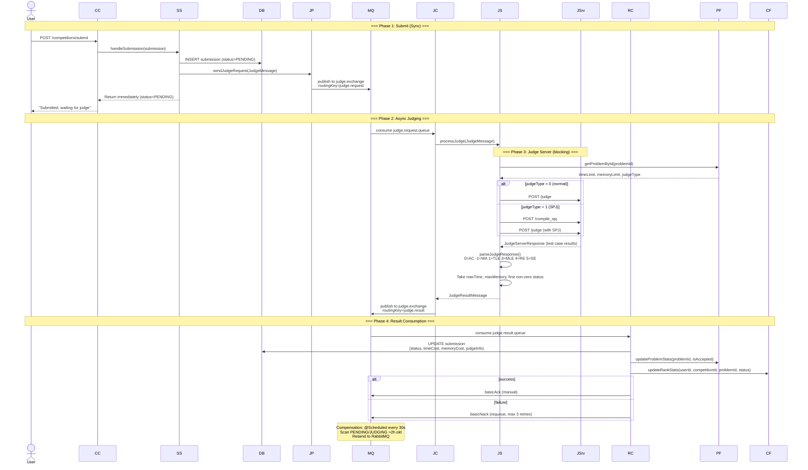
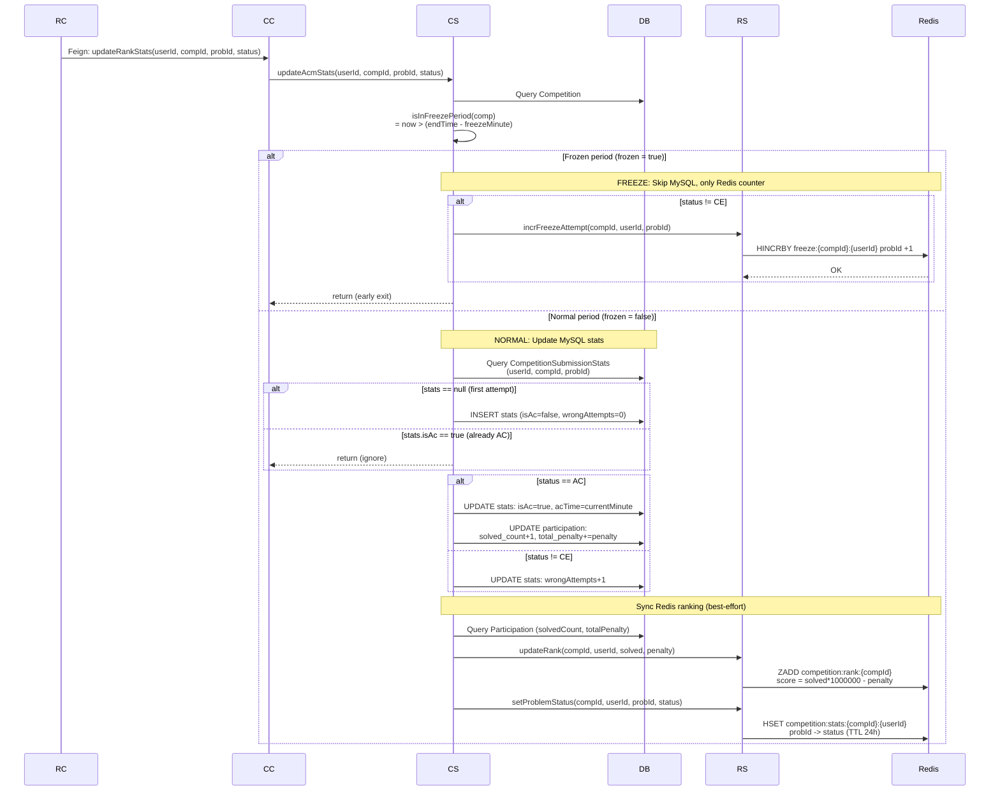
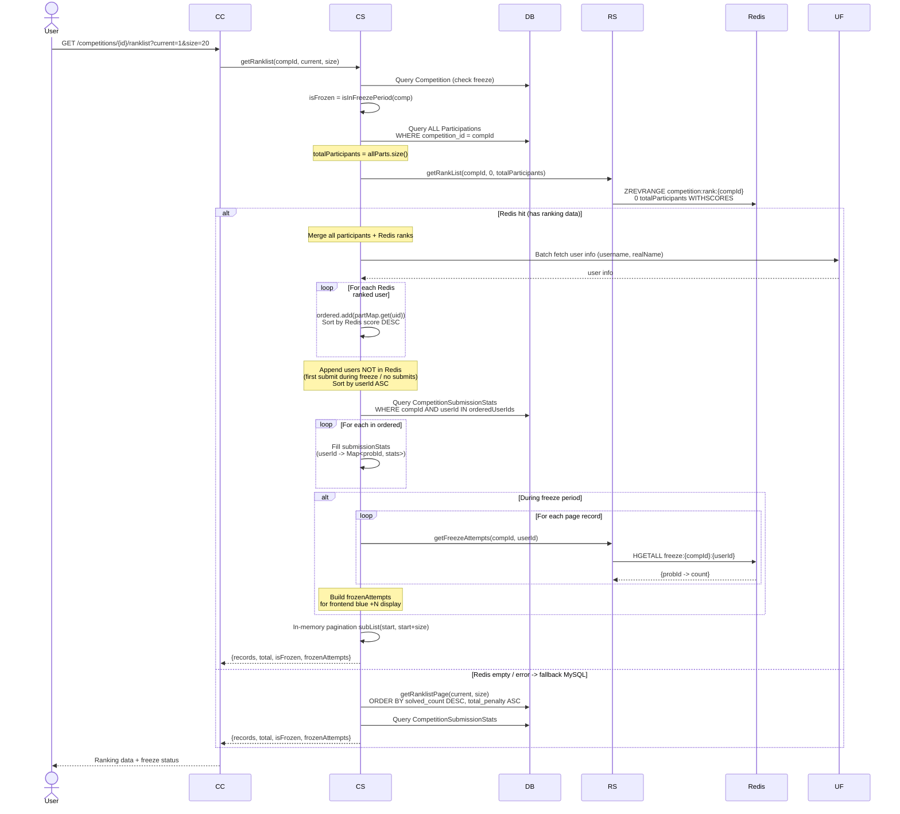
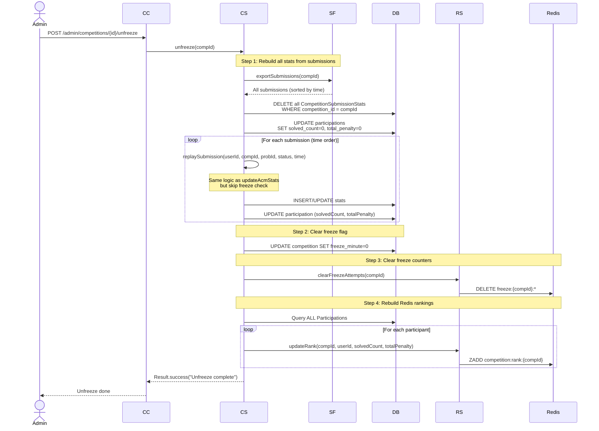

# 判题核心逻辑 & 排行榜更新流程时序图

## 1. 判题核心逻辑（提交 → 判题 → 结果回调）

> **参与者说明**: User=用户, CC=CompetitionController, SS=SubmissionServiceImpl, DB=MySQL, JP=JudgeProducer, MQ=RabbitMQ, JC=JudgeRequestConsumer, JS=JudgeServiceImpl, JSrv=JudgeServer, RC=JudgeResultConsumer, PF=ProblemFeignClient, CF=CompetitionFeignClient



## 2. 排行榜更新流程

### 2.1 实时更新（updateAcmStats）

> **参与者说明**: RC=JudgeResultConsumer, CC=CompetitionController, CS=CompetitionServiceImpl, DB=MySQL, RS=RankingService



### 2.2 读取排行榜（getRanklist）

> **参与者说明**: User=用户, CC=CompetitionController, CS=CompetitionServiceImpl, DB=MySQL, RS=RankingService, UF=UserFeignClient



### 2.3 解封（unfreeze）

> **参与者说明**: Admin=管理员, CC=CompetitionController, CS=CompetitionServiceImpl, SF=SubmissionFeignClient, DB=MySQL, RS=RankingService



## 关键数据结构

| 数据 | 存储位置 | 格式 | 说明 |
|------|---------|------|------|
| 提交记录 | MySQL `submission` | 全字段 | 含 status, timeCost, memoryCost, judgeInfo |
| 单题统计 | MySQL `competition_submission_stats` | userId+compId+probId | isAc, acTime, wrongAttempts (封榜期间不更新) |
| 参赛成绩 | MySQL `participation` | userId+compId | solvedCount, totalPenalty (封榜期间不更新) |
| 排行榜 | Redis ZSET `competition:rank:{compId}` | userId -> score | score = solved x 10^6 - penalty |
| 题目状态 | Redis Hash `competition:stats:{compId}:{userId}` | probId -> status | TTL 24h, 快速判断是否已 AC |
| 封榜计数 | Redis Hash `competition:freeze:{compId}:{userId}` | probId -> attempts | TTL 48h, 前端蓝底 +N 数据源 |

## 封榜状态流转

```
Contest Created -> Started -> ... -> freezeStart = endTime - freezeMinute
                                          |
                                     now > freezeStart ?
                                          | YES
                               isInFreezePeriod = true
                               |  updateAcmStats: Redis only
                               |  getRanklist: frozen ranking
                               |  Frontend: blue cell "+N"
                                          |
                              Admin calls unfreeze()
                                          |
                               Rebuild all MySQL stats
                               freezeMinute = 0
                               Clear Redis freeze counters
                               Rebuild Redis rankings
                                          |
                               isInFreezePeriod = false
```
